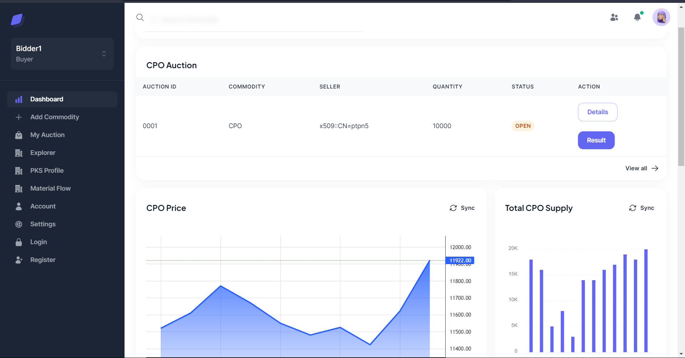

# IBEA: Integrated Blockchain-ERP-Based Auction System

Welcome to the IBEA System GitHub repository! This repository contains the source code for the IBEA System, which stands for Integrated Blockchain-ERP-Based Auction. 

## Introduction

The IBEA System is a sophisticated auction platform that leverages the power of blockchain technology and enterprise resource planning (ERP) systems. It provides a secure and transparent environment for conducting auctions, ensuring fairness, efficiency, and trust.

## Features

- Integration with Blockchain: The IBEA System utilizes blockchain technology to record auction transactions immutably, ensuring transparency and preventing tampering.
- Seamless ERP Integration: It seamlessly integrates with existing ERP systems, allowing efficient management of PKS Profile and Material Flow.
- Secure and Transparent: The system prioritizes security and transparency, providing participants with complete visibility into auction details while ensuring the integrity of the data.
- Comprehensive Reporting: The IBEA System generates detailed reports and analytics, enabling auction organizers to gain valuable insights into bidder behavior and auction performance.

## Contributing

We welcome contributions to the IBEA System project! If you would like to contribute, please follow these guidelines:

1. Fork the repository and create a new branch for your contribution.
2. Make your changes and ensure they adhere to the project's coding conventions.
3. Commit your changes and submit a pull request, providing a clear description of your contribution.

Please note that all contributions will be reviewed, and collaboration is subject to the author's permission.

## License

The IBEA System is protected by copyright. Unauthorized use, distribution, or modification of the source code is strictly prohibited. For inquiries regarding licensing or permissions, please contact the author directly.

## Contact

For any questions or inquiries about the IBEA System, please contact the author at ariesharry3@gmail.com

Thank you for your interest in the IBEA System! We look forward to your contributions and feedback.

